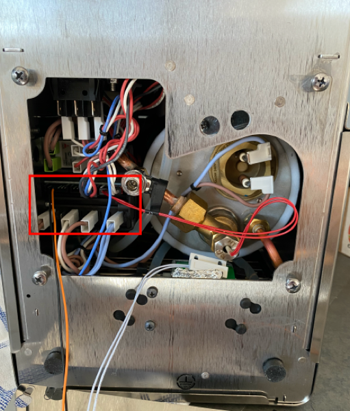
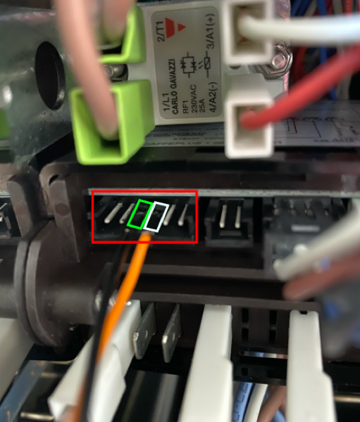

# marax_timer

**[Deutsch](#deutsch)** · **[English](#english)** · **[GitHub](https://github.com/freed40/marax_timer)** · **[Releases](https://github.com/freed40/marax_timer/releases)**

---

<a id="deutsch"></a>

## Deutsch

> [🇬🇧 English version below](#english)

Shot-Timer und Statusanzeige für die **Lelit Mara X** (z. B. PL62X) und ähnliche Maschinen mit **Vibrationspumpe**. Das OLED-Display zeigt Laufzeit, Brühkreis-/Dampftemperaturen und Heizstatus. Steuerung und OTA-Updates über den Browser. Basiert auf **[espresso_timer](https://github.com/alexrus/espresso_timer)**.

### In diesem Repository

| Sketch | Plattform | Ordner | Kurzbeschreibung |
|--------|-----------|--------|------------------|
| **ESP32** | ESP32 DevKit V1 | [`timer_esp32/`](timer_esp32/) | WLAN per Browser, Weboberfläche, Shot-Verlauf, MQTT, OTA |
| **Klassisch** | ESP8266 (NodeMCU) | [`timer/`](timer/) | WiFi aus, SoftwareSerial zur Mara X |

### Funktionsweise

Der Timer kann auf zwei Arten ausgelöst werden — umschaltbar per Weboberfläche ohne erneutes Flashen:

- **Reed-Sensor-Modus** (Standard): Ein Reed-Sensor am Pumpenkörper erkennt das Magnetfeld der laufenden Pumpe.
- **Seriell-Modus**: Der Pumpenstatus wird direkt aus den UART-Daten der Mara X gelesen (letztes Frame-Feld). Kein Reed-Sensor notwendig.

> ⚠️ **Firmware-abhängig!** Der Seriell-Modus funktioniert nur, wenn die Maschine das Pumpenfeld sendet. **fw 1.06** sendet es (7 Felder), **fw 1.23** sendet es **nicht** (nur 6 Felder) — dort ist ein Reed-Sensor zwingend. Details und Frame-Aufbau: [docs/MARAX_SERIAL_PROTOCOL.md](docs/MARAX_SERIAL_PROTOCOL.md).

Shots unter 15 Sekunden (z. B. Boiler-Nachfüllen) werden nicht gespeichert. Nach 1 Stunde Inaktivität wechselt das Display in den Ruhezustand.

### Hardware

#### Gemeinsam

- **0,96″ OLED**, SSD1306, I²C (4 Pins: VCC, GND, SDA, SCL)
- **Reed-Sensor-Modul** (4 Pins: +, G, D0, A0) — typisch NO-Typ, optional im Seriell-Modus
- Reed am **Pumpenkörper** anbringen — das Magnetfeld der laufenden Pumpe schaltet den Kontakt:


#### ESP32 DevKit V1 — Pinbelegung

| Komponente | Modul-Pin | ESP32-Pin | Hinweis |
|------------|-----------|-----------|---------|
| Reed-Modul | **+** | **3,3 V** | Versorgung |
| Reed-Modul | **G** | **GND** | |
| Reed-Modul | **D0** | **GPIO 18** | Digitalsignal, Interrupt |
| Reed-Modul | **A0** | — | nicht belegt |
| OLED | **VCC** | **3,3 V** | |
| OLED | **GND** | **GND** | |
| OLED | **SDA** | **GPIO 21** | I²C Daten |
| OLED | **SCL** | **GPIO 22** | I²C Takt |
| Mara X Pin 3 (RX) | — | **GPIO 17** | UART TX vom ESP (`MARAX_TX`) |
| Mara X Pin 4 (TX) | — | **GPIO 16** | UART RX zum ESP (`MARAX_RX`) |

> **OLED-Adresse:** Die meisten 128×64-Module verwenden `0x3C`. Bei schwarzem Display `SSD1306_I2C_ADDR` auf `0x3D` ändern.

> **Mara X UART:** Der 6-polige Stecker sitzt an der Unterseite der Maschine. Falls keine Daten ankommen, RX/TX tauschen (GPIO 16 ↔ GPIO 17).

> **Hinweis:** GPIO 16/17 werden bewusst genutzt — die früher verwendeten GPIO 12/14 funktionieren nicht zuverlässig (GPIO 12 ist ein Strapping-Pin und stört den Boot).

#### ESP8266 NodeMCU — Pinbelegung

| Komponente | NodeMCU-Pin | GPIO |
|------------|-------------|------|
| Reed Signal | D7 | GPIO 13 |
| OLED SDA | D2 | GPIO 4 |
| OLED SCL | D1 | GPIO 5 |
| Mara X RX | D6 | GPIO 12 |
| Mara X TX | D5 | GPIO 14 |

#### Mara X — serielle Schnittstelle

Die Mara X (V2) hat einen **6-poligen Stecker** an der Unterseite der Maschine. Für Temperatur, Heizstatus und Pumpenstatus per UART werden **Pin 3** (Mara RX) und **Pin 4** (Mara TX) genutzt — **kreuzweise** verbinden: Mara RX → ESP-TX, Mara TX → ESP-RX.

| Mara X | Kabel (typ.) | Funktion | ESP8266 | ESP32 (Sketch) |
|--------|--------------|----------|---------|----------------|
| Pin 3 | schwarz | Mara **RX** (Empfang) | D6 → GPIO 12 | `MARAX_TX` GPIO 17 |
| Pin 4 | orange | Mara **TX** (Senden) | D5 → GPIO 14 | `MARAX_RX` GPIO 16 |

Stecker an der Unterseite — Pin 3 und 4 markiert:



Stecker im Detail:



*Schnittstellen-Fotos: [SaibotFlow/marax-monitor](https://github.com/SaibotFlow/marax-monitor) (GPL-3.0)*

Die Maschine sendet etwa alle **400 ms** eine Zeile (9600 Baud, 8N1). Beispiel: `C1.06,116,124,093,0840,1,0`

| Feld | Beispiel | Bedeutung |
|------|----------|-----------|
| Modus | `C` | `C` = Kaffee, `V` = Dampf |
| Firmware | `1.06` | Maschinen-Firmware |
| Dampf ist | `116` | Aktuelle Dampftemperatur °C |
| Dampf Soll | `124` | Ziel-Dampftemperatur °C |
| HX ist | `093` | Aktuelle Brühkreis-Temperatur °C |
| Boost | `0840` | Boost-Countdown (`0000` = Boost aktiv) |
| Heizung | `1` | `0` = aus, `1` = an |
| Pumpe | `0` | `0` = aus, `1` = an — ⚠️ **nur fw 1.06; fehlt bei fw 1.23** |

> Auf **fw 1.23** sendet die Maschine nur 6 Felder (ohne das Pumpenfeld): `C1.23,121,112,100,0000,0`. Vollständige Doku inkl. Firmware-Unterschiede und Boost-Verhalten: [docs/MARAX_SERIAL_PROTOCOL.md](docs/MARAX_SERIAL_PROTOCOL.md).

### OLED-Display

**Leerlauf** — zweigeteilte Ansicht (Trennlinie bei x=63):

| Links | Rechts |
|-------|--------|
| Kaffeetassen-Icon mit Dampfkringeln | `Zeit:XX` |
| HX-Temperatur groß | Dampfwolken-Icon |
| | Dampftemperatur |

**Shot läuft:**
- Erste 5 Sekunden: `-- Pre-Infusion --` als Kopfzeile, Tasse links, Timer rechts
- Ab 5 Sekunden: Tasse links, großer Timer rechts

Das OLED wechselt alle 10 Sekunden zwischen Normalanzeige und Temperatur-Sparkline (nur im Leerlauf).

### Software-Installation (arduino-cli)

#### 1. arduino-cli installieren

```bash
brew install arduino-cli
```

#### 2. ESP32-Board-Paket einrichten

```bash
arduino-cli config init
arduino-cli config add board_manager.additional_urls \
  https://raw.githubusercontent.com/espressif/arduino-esp32/gh-pages/package_esp32_index.json
arduino-cli core update-index
arduino-cli core install esp32:esp32@2.0.17
```

> Version 2.0.17 empfohlen — neuere Versionen laden einen großen RISC-V-Toolchain nach (>500 MB), der für den Standard-ESP32 nicht benötigt wird.

#### 3. Bibliotheken installieren

```bash
arduino-cli lib install "Adafruit SSD1306" "Adafruit GFX Library" "PubSubClient"
```

#### 4. Kompilieren

```bash
arduino-cli compile --fqbn esp32:esp32:esp32 timer_esp32/
```

#### 5. Flashen (USB)

```bash
arduino-cli upload -p /dev/cu.usbserial-XXX \
  --fqbn esp32:esp32:esp32:UploadSpeed=460800 timer_esp32/
```

Port auf macOS: `/dev/cu.usbserial-*` — mit `ls /dev/cu.usb*` prüfen.  
Bei Fehler `Unable to verify flash chip connection`: BOOT-Taste halten während Upload startet, oder Baudrate auf `115200` reduzieren.

### Firmware-Update ohne Kabel (OTA)

Sobald der ESP32 einmal per USB geflasht und im WLAN ist, können alle weiteren Updates kabellos per Browser eingespielt werden.

**WLAN bleibt erhalten:** Die NVS-Partition wird von OTA nicht überschrieben — SSID, Passwort und alle gespeicherten Einstellungen (Pump-Modus, Zielwerte, AP-Status) bleiben nach jedem Update erhalten.

#### Binary erstellen

```bash
arduino-cli compile \
  --fqbn esp32:esp32:esp32 \
  --export-binaries \
  timer_esp32/
# Datei: timer_esp32/build/esp32.esp32.esp32/timer_esp32.ino.bin
```

#### Im Browser hochladen

1. Browser öffnen: **`http://marax.local/update`**
2. **Token** eingeben (Wert von `OTA_UPDATE_TOKEN` im Sketch, Standard: `maraxota`)
3. **Datei wählen** → die `.bin` aus dem Build-Schritt
4. **Hochladen** → ESP32 startet automatisch neu

#### Versionierung & Release

Die Version steht zentral in [`VERSION`](VERSION) und wird per Script in den Sketch übernommen:

| Datei | Rolle |
|-------|-------|
| [`VERSION`](VERSION) | Einzige Quelle (`X.Y.Z`) |
| [`CHANGELOG.md`](CHANGELOG.md) | Neuerungen; `[Unreleased]` vor Release ausfüllen |
| `timer_esp32.ino` | `FIRMWARE_VERSION` — wird vom Script gesetzt |
| Git-Tag `vX.Y.Z` | löst GitHub Release + OTA-Versionsvergleich aus |

**Neues Release (empfohlen):**

1. Neuerungen in [`CHANGELOG.md`](CHANGELOG.md) unter **`[Unreleased]`** eintragen
2. Version setzen (übernimmt Changelog-Einträge automatisch):

```bash
./scripts/suggest-version-bump.sh          # Empfehlung anzeigen
./scripts/bump-version.sh patch            # 1.1.0 → 1.1.1
./scripts/bump-version.sh minor --push     # 1.1.0 → 1.2.0 + Push
```

Ohne `--push` danach manuell:

```bash
git push origin main && git push origin v1.2.0
```

Bei Tag `v*` erstellt GitHub Actions automatisch ein **Release** mit `.bin`-Dateien. Artefakte bei jedem Push auf `main`: Actions → Lauf → `firmware-esp32`.

**KI / Cursor:** SemVer-Strategie und Release-Ablauf stehen in [`AGENTS.md`](AGENTS.md) und `.cursor/rules/`. Empfehlung vor dem Release: `./scripts/suggest-version-bump.sh`

#### Fehlersuche OTA

| Problem | Lösung |
|---------|--------|
| `/update` zeigt „OTA deaktiviert" | `OTA_UPDATE_TOKEN` setzen, per USB flashen |
| Upload schlägt fehl | Nur `timer_esp32.ino.bin` verwenden, nicht `bootloader.bin` |
| Seite nicht erreichbar nach Update | `http://marax.local/` versuchen oder IP im Router nachschlagen |

### Konfiguration im Sketch

| Variable | Standard | Beschreibung |
|----------|----------|--------------|
| `WIFI_SSID` / `WIFI_PASSWORD` | `""` | Optional: WLAN fest im Sketch (sonst per Browser) |
| `CONFIG_AP_PASSWORD` | `"maraxsetup"` | Passwort für den Konfig-AP (min. 8 Zeichen) |
| `OTA_UPDATE_TOKEN` | `""` | Token für Web-OTA — leer = OTA gesperrt |
| `MQTT_BROKER` | `""` | IP/Hostname des MQTT-Brokers |
| `reedOpenSensor` | `true` | `true` = NO-Sensor, `false` = NC-Sensor — auch per `/test` umschaltbar (NVS-persistent) |
| `SSD1306_I2C_ADDR` | `0x3C` | I²C-Adresse des Displays |

### Weboberfläche (ESP32)

Nach dem Start im Heimnetz erreichbar unter `http://marax.local/` oder der IP-Adresse.

#### Seiten

| URL | Funktion |
|-----|----------|
| `/` | Hauptseite: Live-Pumpenstatus, Shot-Verlauf, Ziel-Einstellungen |
| `/test` | **Diagnose:** Reed (+ Polarität umschalten), Pumpe, Temperaturen, Pump-Quelle, AP-Status, RSSI, UART-Rohdaten mit Feld-Aufschlüsselung |
| `/temps` | Temperatur-Graph (Canvas, 10 Min. Verlauf) |
| `/wifi` | WLAN ändern inkl. **Netzwerk-Scan mit Signalstärke** |
| `/update` | Firmware per Browser (OTA) — nur mit gesetztem Token |

#### API-Endpunkte

| Endpunkt | Methode | Beschreibung |
|----------|---------|--------------|
| `/api/status` | GET | JSON: Pumpe, Timer, Reed, Temp., Pump-Quelle, AP-Status, Demo |
| `/api/history` | GET | JSON: Shot-Verlauf |
| `/api/history.csv` | GET | CSV-Download des Shot-Verlaufs |
| `/api/temp-history` | GET | JSON: Temperatur-Ringpuffer (120 Messpunkte × 5 s) |
| `/api/wifi-scan` | GET | JSON: verfügbare WLAN-Netzwerke mit RSSI |
| `/api/set-target` | POST | `shot=27&hx=93` — Zielwerte speichern |
| `/api/set-pump-source` | POST | `source=reed` oder `source=serial` — Pump-Quelle umschalten |
| `/api/set-ap` | POST | `enabled=1` oder `enabled=0` — Fallback-AP ein/ausschalten |
| `/api/demo` | POST | Demo-Modus umschalten |
| `/api/clear` | POST | Shot-Verlauf löschen |

#### Erste WLAN-Einrichtung

1. ESP32 startet als Access Point **`MaraX-Timer`** (Passwort: `maraxsetup`)
2. Mit Handy/PC verbinden → Browser: `http://192.168.4.1/`
3. Heim-WLAN aus der Liste wählen, Passwort eingeben, speichern
4. ESP32 startet neu — neue IP im Router-DHCP oder `http://marax.local/`

### Pump-Quelle umschalten

```bash
# Auf Seriell-Modus umschalten (kein Reed-Sensor notwendig)
curl -X POST "http://marax.local/api/set-pump-source?source=serial"

# Zurück auf Reed
curl -X POST "http://marax.local/api/set-pump-source?source=reed"
```

Die Einstellung wird in NVS gespeichert und überlebt OTA-Updates und Neustarts. Umschalten auch über `/test` im Browser möglich.

### Fallback-AP

Der ESP32 betreibt parallel zum Heimnetz einen eigenen WLAN-Hotspot (`MaraX-Timer`), über den Diagnose (`/test`) und OTA (`/update`) immer erreichbar sind — auch wenn das Heimnetz nicht verfügbar ist.

| Situation | Verhalten |
|-----------|-----------|
| Heimnetz verbunden, AP aktiv | `marax.local` **und** `192.168.4.1` erreichbar |
| Heimnetz verbunden, AP deaktiviert | Nur `marax.local` |
| Heimnetz nicht verfügbar | Konfig-AP startet immer automatisch (nicht abschaltbar) |

AP ein-/ausschalten: `/test` → Button **„AP aus/an"** oder `POST /api/set-ap?enabled=0`.

### MQTT / Home Assistant

`MQTT_BROKER` im Sketch setzen. Topics (kompatibel mit [alexander-heimbuch/marax_timer](https://github.com/alexander-heimbuch/marax_timer)):

| Topic | Werte |
|-------|-------|
| `/marax/pump` | `on` / `off` |
| `/marax/hx` | Temperatur in °C |
| `/marax/steam` | Temperatur in °C |
| `/marax/shot` | Dauer in Sekunden |
| `/marax/machineheating` | `on` / `off` |
| `/marax/machineheatingboost` | `on` / `off` |

### Fehlersuche

| Problem | Lösung |
|---------|--------|
| Timer startet von allein / reagiert nicht | Reed-Polarität auf `/test` per Button umschalten (NO ↔ NC) |
| Display bleibt schwarz | I²C-Adresse prüfen: `0x3C` oder `0x3D` |
| Keine Mara X-Daten | RX/TX (GPIO 16 ↔ 17) tauschen; `serialAge` auf `/test` prüfen |
| Flash schlägt fehl | Baudrate auf `115200` (`UploadSpeed=115200`), ggf. BOOT-Taste halten |
| Reed-Sensor zu empfindlich | Blaues Poti auf dem Sensor-Modul justieren |
| Pumpe im Seriell-Modus nicht erkannt | Auf `/test` `frameFields` prüfen: bei **6** fehlt das Pumpenfeld (z. B. fw 1.23) → Reed-Sensor nötig. Nur bei **7** Feldern (fw 1.06) liefert Serial die Pumpe |
| WLAN bricht immer wieder ab | RSSI prüfen (`/test` oder USB-Serial `[NET]`-Zeile). Unter ~−78 dBm ist das Signal zu schwach → ESP32 näher zum Router, Repeater, oder externe Antenne |

### Speicher & Grenzen (ESP32)

Der ESP32 DevKit V1 hat zwei voneinander unabhängige Speicher:

| Speicher | Gesamt | Aktuell belegt | Wofür |
|----------|--------|----------------|-------|
| **Flash** (Programm) | 1.280 KB | ~915 KB (**71 %**) | Sketch-Code + Bibliotheken |
| **RAM** (global) | 320 KB | ~49 KB (**15 %**) | Globale Variablen, Puffer |

> Aktuellen Stand immer mit `arduino-cli compile --fqbn esp32:esp32:esp32 timer_esp32/` prüfen — die letzten zwei Zeilen zeigen die Auslastung.

#### Wann wird es eng?

**Flash > 90 %:** Der Sketch lässt sich zwar noch flashen, aber es bleibt kaum Puffer für Erweiterungen. OTA schlägt fehl wenn die Binary größer als die OTA-Partition ist (~640 KB bei manchen Partition-Schemas — beim Standard-Schema mit zwei gleich großen App-Partitionen à 1.28 MB sind wir sicher).

**RAM > 80 %:** Gefährlich. Der restliche Speicher wird dynamisch für den Web-Server, JSON-Strings, HTML-Antworten und den WiFi-Stack genutzt. Zu wenig freier Heap führt zu zufälligen Abstürzen oder hängenden Requests.

#### Was viel Speicher kostet

| Feature | Flash | RAM |
|---------|-------|-----|
| Adafruit SSD1306 + GFX | ~100 KB | ~1 KB |
| WebServer (ESP32) | ~50 KB | Heap pro Request |
| LittleFS | ~30 KB | ~4 KB |
| PubSubClient (MQTT) | ~20 KB | ~5 KB |
| Jede HTML-Seite (F-Makro) | im Flash | 0 RAM |
| String-Konkatenation | 0 Flash | temporär Heap |

#### Tipps wenn Flash knapp wird

- HTML-Seiten mit `F(...)` wrappen (bereits umgesetzt) — speichert Strings im Flash statt im RAM
- Ungenutzte Features (`MQTT_BROKER` leer lassen) kompiliert der Linker meist trotzdem mit — für echte Einsparung Code entfernen
- ESP8266-Sketch hat weniger Features, passt auf kleinerem Flash

### Lizenz & Quellen

Siehe [LICENSE](LICENSE).

- [alexrus / espresso_timer](https://github.com/alexrus/espresso_timer)
- [alexander-heimbuch / marax_timer](https://github.com/alexander-heimbuch/marax_timer)
- [SaibotFlow / marax-monitor](https://github.com/SaibotFlow/marax-monitor) — Protokoll-Referenz, Schnittstellen-Fotos (GPL-3.0)
- [Home-Barista Forum](https://www.home-barista.com/espresso-machines/lelit-marax-t61215-350.html#p723763)
- [YouTube](https://www.youtube.com/watch?v=e9FXYfr5ro4&t=526s)

---

<a id="english"></a>

## English

> [🇩🇪 Deutsche Version oben](#deutsch)

Shot timer and status display for the **Lelit Mara X** (e.g. PL62X) and similar machines with a **vibration pump**. The OLED shows shot time, brew/steam temperatures, and heating status. Fully configurable and updatable via browser. Based on **[espresso_timer](https://github.com/alexrus/espresso_timer)**.

### What's in this repository

| Sketch | Platform | Folder | Summary |
|--------|----------|--------|---------|
| **ESP32** | ESP32 DevKit V1 | [`timer_esp32/`](timer_esp32/) | WiFi via browser, web UI, shot history, MQTT, OTA |
| **Classic** | ESP8266 (NodeMCU) | [`timer/`](timer/) | No WiFi, SoftwareSerial to Mara X |

### How it works

The timer can be triggered in two ways — switchable via the web UI without re-flashing:

- **Reed sensor mode** (default): A reed switch mounted on the pump body detects the pump's magnetic field.
- **Serial mode**: Pump state is read directly from the Mara X UART data stream (last frame field). No reed sensor required.

> ⚠️ **Firmware-dependent!** Serial mode only works if the machine transmits the pump field. **fw 1.06** sends it (7 fields), **fw 1.23** does **not** (only 6 fields) — a reed sensor is mandatory there. Frame layout and details: [docs/MARAX_SERIAL_PROTOCOL.md](docs/MARAX_SERIAL_PROTOCOL.md).

Shots under 15 seconds (e.g. boiler refills) are not saved. After 1 hour of inactivity the display enters sleep mode.

### Hardware

#### Common parts

- **0.96″ OLED**, SSD1306, I²C (4 pins: VCC, GND, SDA, SCL)
- **Reed sensor module** (4 pins: +, G, D0, A0) — typically NO type, optional in serial mode
- Mount the reed on the **pump body** — the running pump's magnetic field closes the contact:


#### ESP32 DevKit V1 — pinout

| Component | Module pin | ESP32 pin | Notes |
|-----------|------------|-----------|-------|
| Reed module | **+** | **3.3 V** | Power |
| Reed module | **G** | **GND** | |
| Reed module | **D0** | **GPIO 18** | Digital signal, interrupt |
| Reed module | **A0** | — | not used |
| OLED | **VCC** | **3.3 V** | |
| OLED | **GND** | **GND** | |
| OLED | **SDA** | **GPIO 21** | I²C data |
| OLED | **SCL** | **GPIO 22** | I²C clock |
| Mara X pin 3 (RX) | — | **GPIO 17** | UART TX from ESP (`MARAX_TX`) |
| Mara X pin 4 (TX) | — | **GPIO 16** | UART RX to ESP (`MARAX_RX`) |

> **OLED address:** Most 128×64 modules use `0x3C`. If the display stays blank, set `SSD1306_I2C_ADDR` to `0x3D`.

> **Mara X UART:** The 6-pin connector is on the underside of the machine. If you get no data, swap RX/TX (GPIO 16 ↔ GPIO 17).

> **Note:** GPIO 16/17 are used deliberately — the previously used GPIO 12/14 are unreliable (GPIO 12 is a strapping pin that interferes with boot).

#### ESP8266 NodeMCU — pinout

| Component | NodeMCU pin | GPIO |
|-----------|-------------|------|
| Reed signal | D7 | GPIO 13 |
| OLED SDA | D2 | GPIO 4 |
| OLED SCL | D1 | GPIO 5 |
| Mara X RX | D6 | GPIO 12 |
| Mara X TX | D5 | GPIO 14 |

#### Mara X — serial interface

The Mara X (V2) has a **6-pin connector** on the underside. For temperature, heating status, and pump state via UART, use **pin 3** (Mara RX) and **pin 4** (Mara TX) — wire **crossed**: Mara RX → ESP TX, Mara TX → ESP RX.

| Mara X | Wire (typ.) | Function | ESP8266 | ESP32 (sketch) |
|--------|-------------|----------|---------|----------------|
| Pin 3 | black | Mara **RX** (receive) | D6 → GPIO 12 | `MARAX_TX` GPIO 17 |
| Pin 4 | orange | Mara **TX** (transmit) | D5 → GPIO 14 | `MARAX_RX` GPIO 16 |

Connector on the underside — pins 3 and 4 marked:


Connector close-up:


*Interface photos: [SaibotFlow/marax-monitor](https://github.com/SaibotFlow/marax-monitor) (GPL-3.0)*

The machine sends a line about every **400 ms** (9600 baud, 8N1). Example: `C1.06,116,124,093,0840,1,0`

| Field | Example | Meaning |
|-------|---------|---------|
| Mode | `C` | `C` = coffee, `V` = steam |
| Firmware | `1.06` | Machine firmware |
| Steam act. | `116` | Current steam temp °C |
| Steam target | `124` | Target steam temp °C |
| HX act. | `093` | Current brew (HX) temp °C |
| Boost | `0840` | Boost countdown (`0000` = boost active) |
| Heating | `1` | `0` = off, `1` = on |
| Pump | `0` | `0` = off, `1` = on — ⚠️ **fw 1.06 only; absent on fw 1.23** |

> On **fw 1.23** the machine sends only 6 fields (no pump field): `C1.23,121,112,100,0000,0`. Full docs incl. firmware differences and boost behaviour: [docs/MARAX_SERIAL_PROTOCOL.md](docs/MARAX_SERIAL_PROTOCOL.md).

### OLED Display

**Idle** — two-column layout (divider at x=63):

| Left | Right |
|------|-------|
| Coffee cup icon with steam wisps | `Time:XX` |
| HX temperature (large) | Steam cloud icon |
| | Steam temperature |

**Shot running:**
- First 5 seconds: `-- Pre-Infusion --` header, cup left, timer right
- After 5 seconds: cup left, large timer right

The OLED alternates between the normal view and a temperature sparkline every 10 seconds (idle only).

### Software setup (arduino-cli)

#### 1. Install arduino-cli

```bash
brew install arduino-cli
```

#### 2. Set up ESP32 board package

```bash
arduino-cli config init
arduino-cli config add board_manager.additional_urls \
  https://raw.githubusercontent.com/espressif/arduino-esp32/gh-pages/package_esp32_index.json
arduino-cli core update-index
arduino-cli core install esp32:esp32@2.0.17
```

> Version 2.0.17 recommended — newer versions download a large RISC-V toolchain (>500 MB) not needed for the standard ESP32.

#### 3. Install libraries

```bash
arduino-cli lib install "Adafruit SSD1306" "Adafruit GFX Library" "PubSubClient"
```

#### 4. Compile

```bash
arduino-cli compile --fqbn esp32:esp32:esp32 timer_esp32/
```

#### 5. Flash (USB)

```bash
arduino-cli upload -p /dev/cu.usbserial-XXX \
  --fqbn esp32:esp32:esp32:UploadSpeed=460800 timer_esp32/
```

On macOS check port with `ls /dev/cu.usb*`.  
If you see `Unable to verify flash chip connection`: hold the BOOT button while upload starts, or reduce baud rate to `115200`.

### Firmware update without a cable (OTA)

Once the ESP32 has been flashed via USB and joined your WiFi, all further updates can be done wirelessly.

**WiFi survives OTA:** The NVS partition is never overwritten — SSID, password, and all saved settings (pump mode, target values, AP state) are preserved after every update.

#### Build the binary

```bash
arduino-cli compile \
  --fqbn esp32:esp32:esp32 \
  --export-binaries \
  timer_esp32/
# File: timer_esp32/build/esp32.esp32.esp32/timer_esp32.ino.bin
```

#### Upload in the browser

1. Open **`http://marax.local/update`**
2. Enter the **token** (`OTA_UPDATE_TOKEN` from the sketch, default: `maraxota`)
3. **Choose file** → the `.bin` from the build step
4. Click **Upload** → ESP32 reboots automatically

#### Versioning & release

The version lives in [`VERSION`](VERSION) and is synced into the sketch by script:

| File | Role |
|------|------|
| [`VERSION`](VERSION) | Single source of truth (`X.Y.Z`) |
| [`CHANGELOG.md`](CHANGELOG.md) | What's new; fill in `[Unreleased]` before release |
| `timer_esp32.ino` | `FIRMWARE_VERSION` — set by the script |
| Git tag `vX.Y.Z` | triggers GitHub Release + OTA version check |

**New release (recommended):**

1. Add changes under **`[Unreleased]`** in [`CHANGELOG.md`](CHANGELOG.md)
2. Bump version (moves changelog entries automatically):

```bash
./scripts/suggest-version-bump.sh          # show recommendation
./scripts/bump-version.sh patch            # 1.1.0 → 1.1.1
./scripts/bump-version.sh minor --push     # 1.1.0 → 1.2.0 + push
```

Without `--push`, push manually:

```bash
git push origin main && git push origin v1.2.0
```

Tag `v*` creates a GitHub **Release** with `.bin` files. Artifacts on every push to `main`: Actions → run → `firmware-esp32`.

**AI / Cursor:** See [`AGENTS.md`](AGENTS.md) and `.cursor/rules/`. Before release: `./scripts/suggest-version-bump.sh`

#### OTA troubleshooting

| Problem | Fix |
|---------|-----|
| `/update` shows "OTA disabled" | Set `OTA_UPDATE_TOKEN`, flash via USB |
| Upload fails | Use only `timer_esp32.ino.bin`, not `bootloader.bin` |
| Device unreachable after update | Try `http://marax.local/` or look up IP in router |

### Sketch configuration

| Variable | Default | Description |
|----------|---------|-------------|
| `WIFI_SSID` / `WIFI_PASSWORD` | `""` | Optional: hardcode WiFi credentials (otherwise via browser) |
| `CONFIG_AP_PASSWORD` | `"maraxsetup"` | Config AP password (min. 8 chars for WPA2) |
| `OTA_UPDATE_TOKEN` | `""` | OTA token — empty disables OTA |
| `MQTT_BROKER` | `""` | MQTT broker IP/hostname |
| `reedOpenSensor` | `true` | `true` = NO sensor, `false` = NC sensor |
| `SSD1306_I2C_ADDR` | `0x3C` | OLED I²C address |

### Web interface (ESP32)

Available at `http://marax.local/` or the ESP32's IP address.

#### Pages

| URL | Function |
|-----|----------|
| `/` | Main page: live pump status, shot history, target settings |
| `/test` | **Diagnostics:** reed, pump, temperatures, pump source, AP state, UART raw data |
| `/temps` | Temperature graph (Canvas, 10 min history) |
| `/wifi` | Change WiFi incl. **network scan with signal strength** |
| `/update` | Browser firmware upload (OTA) — token required |

#### API endpoints

| Endpoint | Method | Description |
|----------|--------|-------------|
| `/api/status` | GET | JSON: pump, timer, reed, temps, pump source, AP state, demo |
| `/api/history` | GET | JSON: shot history |
| `/api/history.csv` | GET | CSV download of shot history |
| `/api/temp-history` | GET | JSON: temperature ring buffer (120 samples × 5 s) |
| `/api/wifi-scan` | GET | JSON: available networks with RSSI |
| `/api/set-target` | POST | `shot=27&hx=93` — save target values |
| `/api/set-pump-source` | POST | `source=reed` or `source=serial` — switch pump trigger |
| `/api/set-ap` | POST | `enabled=1` or `enabled=0` — toggle fallback AP |
| `/api/demo` | POST | Toggle demo mode |
| `/api/clear` | POST | Clear shot history |

#### First-time WiFi setup

1. ESP32 starts as access point **`MaraX-Timer`** (password: `maraxsetup`)
2. Connect phone/PC → browser: `http://192.168.4.1/`
3. Pick home WiFi from list, enter password, save
4. ESP32 reboots — new IP from router DHCP or `http://marax.local/`

### Switching pump source

```bash
# Switch to serial mode (no reed sensor needed)
curl -X POST "http://marax.local/api/set-pump-source?source=serial"

# Switch back to reed
curl -X POST "http://marax.local/api/set-pump-source?source=reed"
```

The setting is stored in NVS and survives OTA updates and reboots. Can also be toggled on the `/test` page.

### Fallback AP

The ESP32 runs its own WiFi hotspot (`MaraX-Timer`) alongside the home network, so diagnostics (`/test`) and OTA (`/update`) are always reachable — even if the home network is unavailable.

| Situation | Behaviour |
|-----------|-----------|
| Home WiFi connected, AP on | `marax.local` **and** `192.168.4.1` reachable |
| Home WiFi connected, AP off | Only `marax.local` |
| Home WiFi unavailable | Config AP always starts automatically (cannot be disabled) |

Toggle AP: `/test` → **"AP off/on"** button, or `POST /api/set-ap?enabled=0`.

### MQTT / Home Assistant

Set `MQTT_BROKER` in the sketch. Topics (compatible with [alexander-heimbuch/marax_timer](https://github.com/alexander-heimbuch/marax_timer)):

| Topic | Values |
|-------|--------|
| `/marax/pump` | `on` / `off` |
| `/marax/hx` | Temperature in °C |
| `/marax/steam` | Temperature in °C |
| `/marax/shot` | Duration in seconds |
| `/marax/machineheating` | `on` / `off` |
| `/marax/machineheatingboost` | `on` / `off` |

### Troubleshooting

| Problem | Fix |
|---------|-----|
| Timer starts on its own / does not react | Toggle reed polarity via the button on `/test` (NO ↔ NC) |
| Display stays blank | Check I²C address: `0x3C` or `0x3D` |
| No Mara X data | Swap RX/TX (GPIO 16 ↔ 17); check `serialAge` on `/test` |
| Flash fails | Baud rate `115200` (`UploadSpeed=115200`), hold BOOT if needed |
| Reed sensor too sensitive | Adjust the blue potentiometer on the sensor module |
| Pump not detected in serial mode | Check `frameFields` on `/test`: **6** means no pump field (e.g. fw 1.23) → reed sensor required. Only **7** fields (fw 1.06) carry pump state |
| WiFi keeps dropping | Check RSSI (`/test` or USB-serial `[NET]` line). Below ~−78 dBm the signal is too weak → move ESP32 closer to router, add a repeater, or use an external antenna |

### Memory & limits (ESP32)

The ESP32 DevKit V1 has two independent memory regions:

| Memory | Total | Currently used | Purpose |
|--------|-------|----------------|---------|
| **Flash** (program) | 1,280 KB | ~915 KB (**71 %**) | Sketch code + libraries |
| **RAM** (global) | 320 KB | ~49 KB (**15 %**) | Global variables, buffers |

> Always check current usage with `arduino-cli compile --fqbn esp32:esp32:esp32 timer_esp32/` — the last two lines show the numbers.

#### When does it get tight?

**Flash > 90 %:** The sketch still compiles and flashes, but there's little room for extensions. OTA fails if the binary exceeds the OTA partition size — with the default partition scheme (two equal app partitions of ~1.28 MB each) we are well within limits.

**RAM > 80 %:** Dangerous. The remaining heap is used dynamically for web server responses, JSON strings, HTML pages, and the WiFi stack. Too little free heap causes random crashes or hanging requests.

#### What uses the most memory

| Feature | Flash | RAM |
|---------|-------|-----|
| Adafruit SSD1306 + GFX | ~100 KB | ~1 KB |
| WebServer (ESP32) | ~50 KB | heap per request |
| LittleFS | ~30 KB | ~4 KB |
| PubSubClient (MQTT) | ~20 KB | ~5 KB |
| HTML pages (with `F()`) | in flash | 0 RAM |
| String concatenation | 0 flash | temporary heap |

#### Tips when flash gets tight

- Wrap string literals with `F(...)` — stores them in flash instead of RAM (already done throughout)
- Leaving `MQTT_BROKER` empty does not save flash — to actually reduce size, remove the code
- The ESP8266 sketch has fewer features and fits on smaller flash

### License & sources

See [LICENSE](LICENSE).

- [alexrus / espresso_timer](https://github.com/alexrus/espresso_timer)
- [alexander-heimbuch / marax_timer](https://github.com/alexander-heimbuch/marax_timer)
- [SaibotFlow / marax-monitor](https://github.com/SaibotFlow/marax-monitor) — serial protocol reference, interface photos (GPL-3.0)
- [Home-Barista forum](https://www.home-barista.com/espresso-machines/lelit-marax-t61215-350.html#p723763)
- [YouTube](https://www.youtube.com/watch?v=e9FXYfr5ro4&t=526s)
